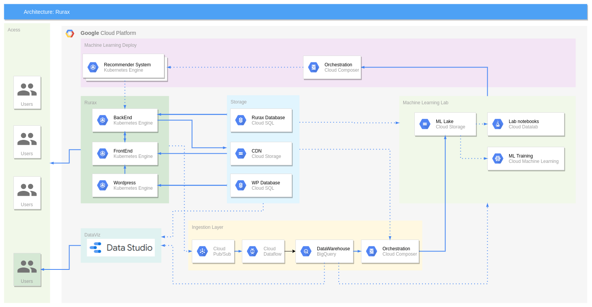

# Data Pipeline

## Dependences

*  Serverless Framework (https://www.serverless.com/framework/docs/getting-started/)

## Functions

* **event_pubsub_subscribe**: Pipeline Pubsub->BQ
* **export_bq_to_gcs**:
* **build_dataset_01**:

## Docker

## Links uteis

* https://github.com/GoogleCloudPlatform/solutions-gcs-bq-streaming-functions-python/blob/master/functions/streaming/main.py